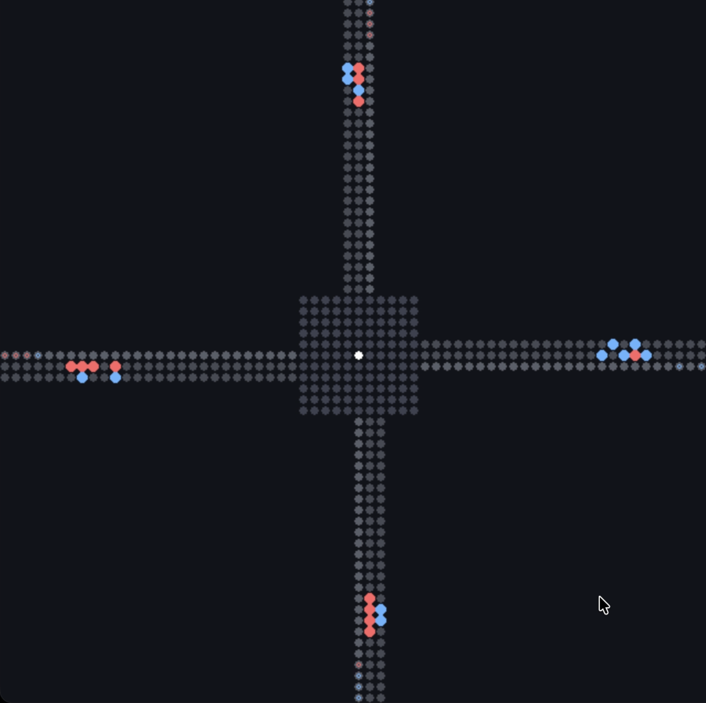
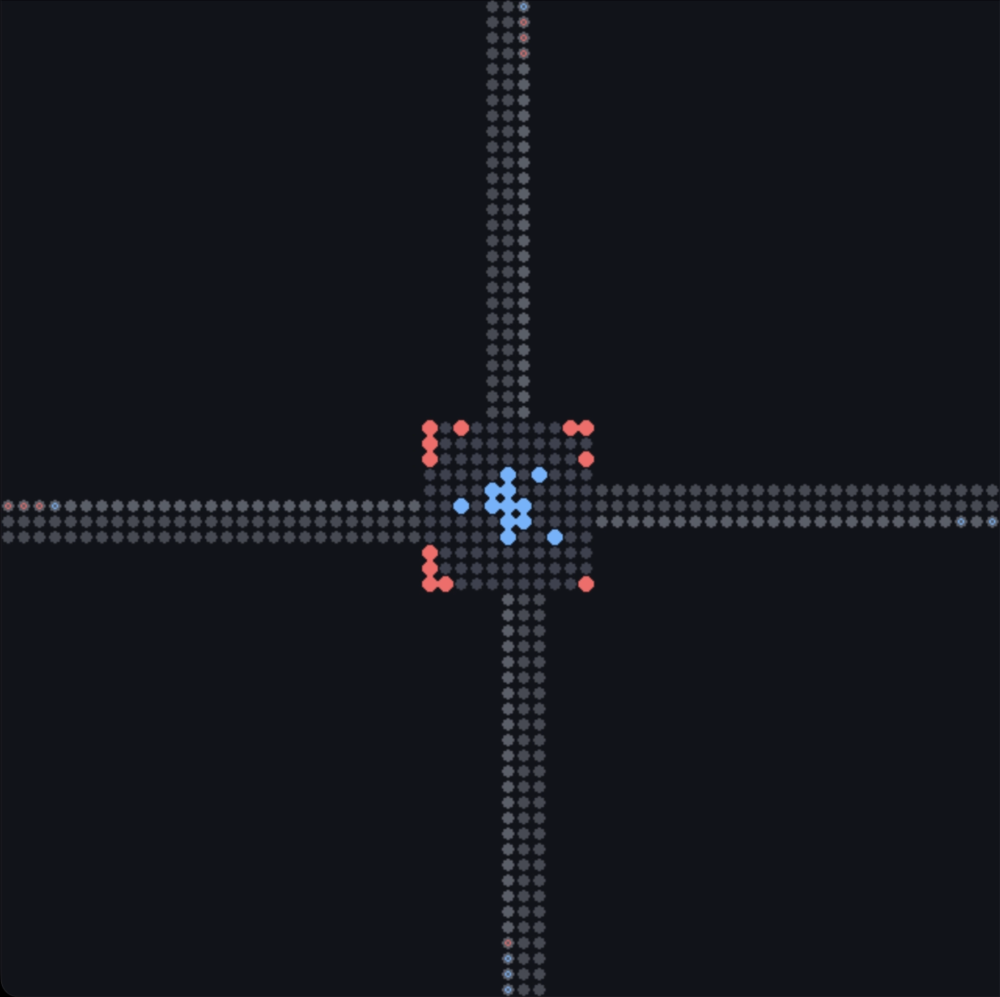
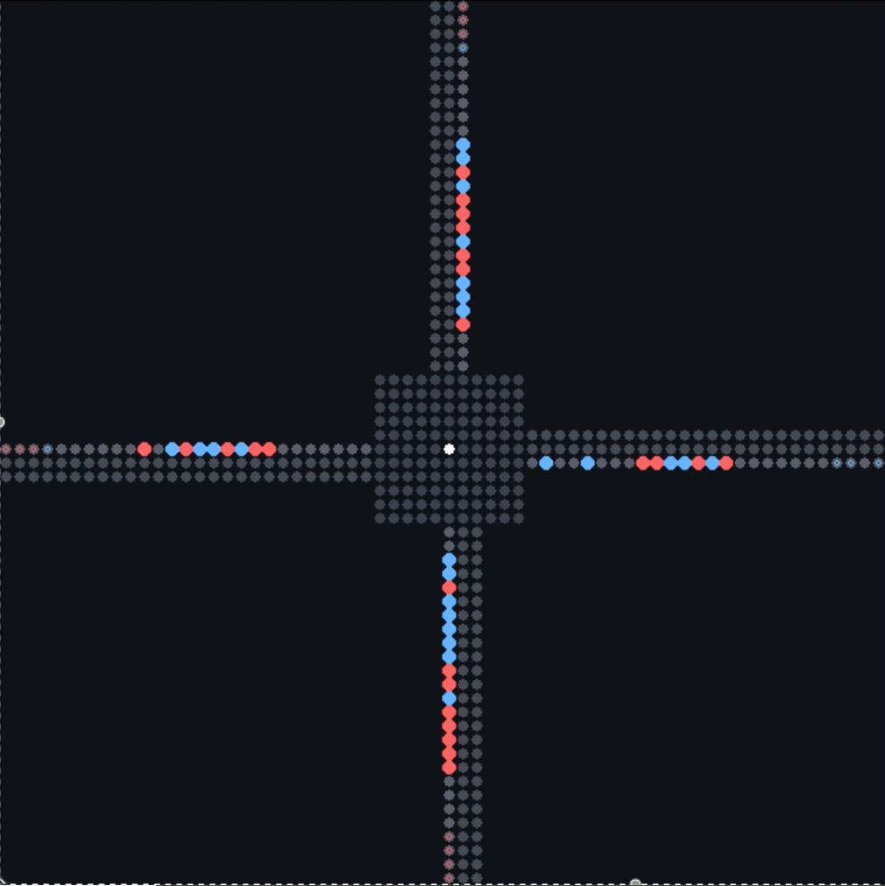
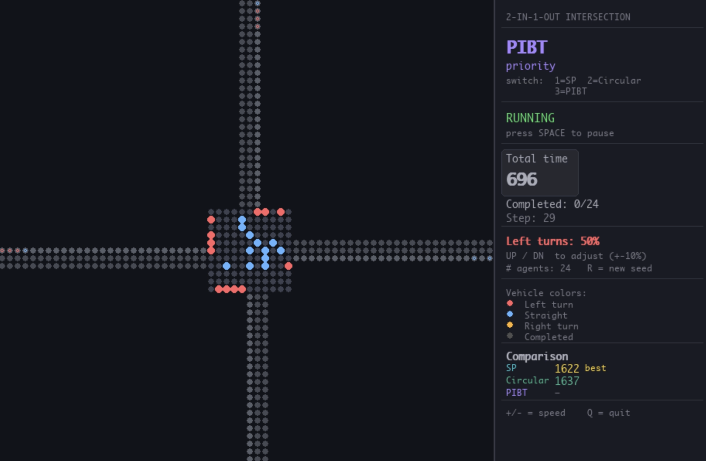
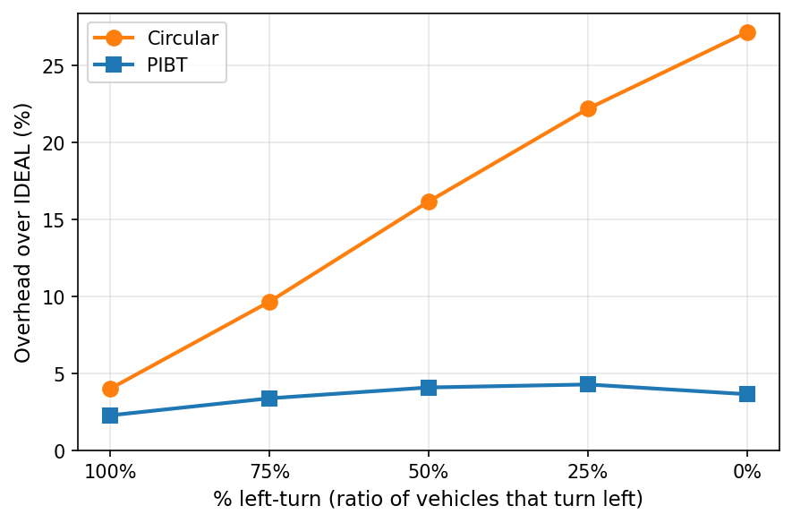

# GLC: Guided Local Coordination for Large-Scale Road Networks

This repository contains the source code for the paper:

> Zhenhui Jessie Li. 2026. **Local Rules, Global Efficiency: Emergent Coordination on Large-Scale Road Networks.** In *Proceedings of the 32nd ACM SIGKDD Conference on Knowledge Discovery and Data Mining V.2* (KDD '26), August 09–13, 2026, Jeju Island, Republic of Korea. ACM, New York, NY, USA. https://doi.org/10.1145/3770855.3818071

**[Project Page](https://jessielzh.github.io/GLC-road-coordination/)** &nbsp;|&nbsp; **[Paper (ACM DL)](https://doi.org/10.1145/3770855.3818071)**

---

## Emergent Circulation at a Four-Way Intersection

| (a) Inbound approach | (b) At the intersection | (c) Outbound after turning |
|:---:|:---:|:---:|
|  |  |  |

Illustrative snapshots of emergent circulation under PIBT-style conflict resolution. Red agents are left-turn vehicles. Rather than executing direct left turns that repeatedly cross opposing flows, left-turn agents implicitly "merge" into a one-way ring inside the intersection and exit when aligned with their desired outbound lane, resembling a roundabout.


---

## Installation

```bash
pip install -r requirements.txt
```

Requires Python 3.8+ and the dependencies listed in `requirements.txt`: NumPy, matplotlib, pygame, NetworkX, OSMnx, pandas, pyarrow, geopandas, pyproj, imageio.


## Experiments

### 1. Four-way 2-in-1-out intersection

#### Table 1 — Total delay, 24 agents, 30% left / 35% straight / 35% right (mean over 3 seeds)

```bash
python compare_2in1out.py --agents 24 --left-ratio 0.3 --right-ratio 0.35 --seeds 85 196 410
```

| Method   | Seed 85 | Seed 196 | Seed 410 | Mean    | Overhead |
|----------|--------:|---------:|---------:|--------:|:--------:|
| IDEAL    | 1,428   | 1,428    | 1,412    | 1,423   | —        |
| SP       | 1,897   | 1,891    | 1,867    | 1,885   | +32%     |
| Circular | 1,713   | 1,712    | 1,746    | 1,724   | +21%     |
| PIBT     | 1,458   | 1,464    | 1,450    | 1,457   | +2%      |
| G-PIBT   | 1,477   | 1,476    | 1,468    | 1,474   | +4%      |
| GLC      | 1,466   | 1,484    | 1,476    | 1,475   | +4%      |


#### Figure 1 — Emergent circulation demo

```bash
python visualize_2in1out.py --agents 24 --left-ratio 0.5 --right-ratio 0
```

Demo screenshot



Demo (methods: `sp`, `pibt`, `circular`; press 1/2/3 to switch):

<video src="docs/media/emergent-pattern.mov" controls width="100%"></video>


#### Figure 2 — Overhead over IDEAL vs left-turn ratio (PIBT vs Circular)

```bash
python plot_4way_circular_vs_pibt.py
```




### 2. Small Road Network (3×3)

#### Table 2 — Total delay vs number of agents

```bash
python -c "from experiments_summary import run_3x3_limited; run_3x3_limited(seeds=[42], max_steps=500)"
```

| Agents | IDEAL | SP          | PIBT        | G-PIBT      | GLC         |
|-------:|------:|------------:|------------:|------------:|------------:|
| 8      | 248   | 257 (+3%)   | 248 (+0%)   | 248 (+0%)   | 248 (+0%)   |
| 16     | 511   | 530 (+4%)   | 514 (+1%)   | 515 (+1%)   | 514 (+0%)   |
| 24     | 795   | 825 (+4%)   | 798 (+0%)   | 802 (+1%)   | 800 (+1%)   |
| 32     | 1,055 | 1,096 (+4%) | 1,061 (+1%) | 1,072 (+2%) | 1,063 (+1%) |
| 40     | 1,297 | 1,352 (+4%) | 1,309 (+1%) | 1,328 (+2%) | 1,311 (+1%) |
| 60     | 1,977 | 2,080 (+5%) | 2,019 (+2%) | 2,042 (+3%) | 2,111 (+7%) |


### 3. City-scale Manhattan

#### Table 3 — Total delay and runtime, Manhattan road network

`sample_od_10k.parquet` contains 10,000 OD trips sampled from the NYC TLC January 2024 dataset (seed=42, Manhattan zones only). The commands use the first N rows for N agents, so results are fully reproducible. For full-scale reproduction, download `yellow_tripdata_2024-01.parquet` from [NYC TLC Trip Record Data](https://www.nyc.gov/site/tlc/about/tlc-trip-record-data.page) and pass its path instead.

**Road network:** Manhattan directed graph — **4,594 nodes**, **9,856 edges** (cached in `.manhattan_cache/manhattan_graph.graphml`).

> **Note:** Runtimes vary by machine. Delay overhead percentages are machine-independent and should match the paper's values closely.

**100 agents** (IDEAL, SP, TAP, PIBT, G-PIBT, GLC):

```bash
python run_manhattan_large_scale.py sample_od_10k.parquet --agents 100 --methods ideal,sp,tap,pibt,gpibt,glc --output-csv manhattan_100_progress.csv --progress-interval 1
```

| Method  | Total Delay | Overhead | Completion | Runtime (s) |
|---------|------------:|---------:|:----------:|------------:|
| IDEAL   | 2,457       | —        | 100%       | 0.02        |
| SP      | 2,607       | +6.1%    | 100%       | 0.26        |
| TAP     | 2,698       | +9.8%    | 100%       | 6.51        |
| PIBT    | 2,522       | +2.6%    | 100%       | 0.76        |
| G-PIBT  | 2,633       | +7.2%    | 100%       | 49.82       |
| GLC     | 2,600       | +5.8%    | 100%       | 0.69        |

**1,000 agents** (IDEAL, SP, PIBT, GLC):

```bash
python run_manhattan_large_scale.py sample_od_10k.parquet --agents 1000 --methods ideal,sp,pibt,glc --output-csv manhattan_1000_progress.csv --progress-interval 1
```

| Method  | Total Delay | Overhead | Completion | Runtime (s) |
|---------|------------:|---------:|:----------:|------------:|
| IDEAL   | 23,850      | —        | 100%       | 0.19        |
| SP      | 33,250      | +39.4%   | 100%       | 4.55        |
| PIBT    | 30,573      | +28.2%   | 100%       | 11.42       |
| GLC     | 32,062      | +34.4%   | 100%       | 11.08       |

**10,000 agents** (IDEAL, SP, PIBT, GLC):

```bash
python run_manhattan_large_scale.py sample_od_10k.parquet --agents 10000 --methods ideal,sp,pibt,glc --output-csv manhattan_10000_progress.csv --progress-interval 1
```

| Method  | Total Delay   | Overhead  | Completion | Runtime (s) |
|---------|-------------:|----------:|:----------:|------------:|
| IDEAL   | 243,125       | —         | 100%       | 2.12        |
| SP      | 2,203,068     | +806.1%   | 100%       | 618.78      |
| PIBT    | 1,075,988     | +342.6%   | 100%       | 741.36      |
| GLC     | 1,017,513     | +318.5%   | 100%       | 630.91      |


## License

MIT License.
